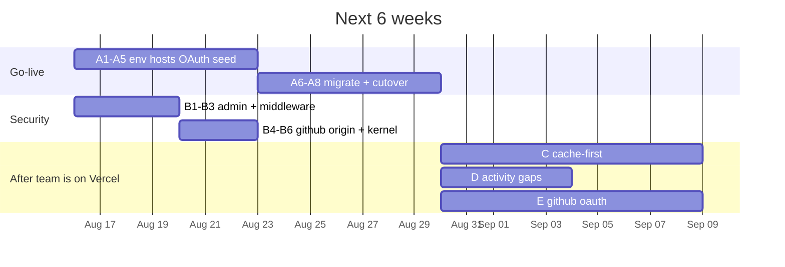

# Internal Portal — Implementation Plan (current app)

**Document version:** 2.0  
**Date:** 2026-08-16  
**Status:** Forward plan against the live Next.js codebase on `main`  
**Supersedes:** v1.x (Phases 0–8 migration from static GitHub Pages + Firebase)

Phases 0–8 are **implemented in code**. This plan does not re-propose Google OAuth, Redis sessions, Postgres, or the observability module. It starts from what the repo actually does, lists remaining gaps, and sequences the work to go live and harden it.

Companion ops: [RUNBOOK.md](./RUNBOOK.md).

---

## 1. As-built snapshot

### Stack (what exists)

| Layer | Implementation |
|-------|----------------|
| App | Next.js 16 App Router, JavaScript, `basePath: /Internal-App` |
| Auth | Google OAuth **authorization code** → `/api/auth/google` → `/api/auth/callback` |
| Session | HttpOnly `sid` cookie; Redis payload; **7-day sliding TTL**; optional daily `sid` rotation |
| Data | PostgreSQL JSONB collections via `/api/data/*` and `/api/sync/*` |
| Client data path | `portalApi.js` → `dataApi.js` → `cacheManager.js` (localStorage) |
| Abuse control | Redis sliding windows in `withApi` |
| Telemetry | `RequestLogger` + Redis pub/sub + admin SSE; `ActivityTracker` |
| Admin UI | `/admin/observability/` — live API feed + activity + history + session kill |
| Hosting intent | Vercel + Neon + Upstash (`vercel.json` cron + `/` → `/Internal-App/`) |
| Firebase | **GitHub OAuth only** (`/github-connect/`); module data is Postgres |

### Auth / session (what exists)

```
Login button
  → GET /api/auth/google  (account picker, prompt=select_account)
  → Google redirect with HMAC-signed state
  → GET /api/auth/callback
       verify id_token
       whitelist (role_access.allowed)
       upsert users + session in Redis (TTL 604800s)
       Set-Cookie sid (HttpOnly, SameSite=Lax, Secure in prod, path=/Internal-App)
  → SessionProvider GET /api/auth/me (touches sliding TTL, may rotate sid)

Logout → POST /api/auth/logout → DEL Redis key + clear cookie + localStorage cache
```

Middleware cookies-gates portal pages. API routes enforce session in `withApi`. UI keys still in **sessionStorage** only: `activeModule`, `isAdminView`, `messages.vault.*`, `portalTabSessionId`. Auth identity is **not** in sessionStorage.

### Data path (what exists)

- Tables: `collection_*` JSONB rows with `updated_at` / `deleted_at`
- Reads: `GET /api/sync/:collection?since=` (delta) or full `GET /api/data/:collection`
- Writes: **full-array `PUT /api/data/:collection`** (same as the old Firestore document replace)
- Client cache: `portal:v1:{uid}:{collection}` in localStorage
- Server authorization: `lib/server/authorize.js` (ported from client rules)

### Observability (what exists)

- Every `/api/*` handler wrapped by `withApi` → Redis publish + `api_request_logs`
- Semantic events: `module.visit` / `leave`, `apps.view_detail`, `changelog.view`, `apps.back_to_all`, `nav.home`, `admin.toggle_view`, `auth.login` / `logout`
- Admin SSE: `/api/admin/stream/requests` and `/activity` (`maxDuration = 60`)
- Header chart button (admin mode) → observability module

### Not done (despite v1 “complete”)

These are **operational**, not missing folders:

1. Production Vercel / Neon / Upstash not confirmed live from this machine
2. Google OAuth **E2E login** not verified (needs `GOOGLE_*` env)
3. Firestore → Postgres **production cutover** not run (`npm run migrate:firestore`)
4. Hub/team still using whatever the previous static app served

---

## 2. Gap analysis vs original product goals

Original goals: Google account picker (no Firebase login), 7-day sessions, Redis rate limits, local-first delta sync, admin activity + **real-time API endpoints**.

| Goal | Current state | Gap |
|------|---------------|-----|
| Google account picker | Implemented | Needs Console redirect URIs + E2E |
| 7-day stay-logged-in | Sliding Redis TTL + cookie maxAge 7d | Middleware only checks cookie **presence**, not Redis validity |
| Distributed rate limits | Redis, per IP/user/sync/activity/write | Fine |
| Local copy, update only deltas | Sync API + localStorage **after** network | Cache is **not paint-first**; modules wait on `/api/sync` |
| Activity trail | Path + selected app actions | Missing `changelog.add`; no Investor Pulse module in this app |
| Real-time API monitor | SSE + live table | Vercel Hobby SSE **60s** (browser reconnects); extra Redis usage |
| No Firebase | Data: yes. GitHub PAT: still Firebase Auth | GitHub connect + PAT in sessionStorage + `postMessage(..., "*")` |
| Server-enforced admin | Roles in Redis session | `?admin=1` on data PUT still treated as admin view (goals skip owner guard) |

---

## 3. Guided architecture (unchanged, now real)

```
Browser
  ├── SessionProvider     GET /api/auth/me
  ├── CacheManager        localStorage (should become cache-first)
  ├── ActivityTracker     POST /api/activity
  └── Modules             GET/PUT /api/data + /api/sync

Next.js
  ├── middleware.js       cookie presence + public prefixes
  ├── withApi             auth, rate limit, RequestLogger
  └── /api/admin/stream/* SSE ← Redis pub/sub

Redis     sessions · rate limits · pub/sub · stream replay
Postgres  users · collections · activity_logs · api_request_logs
Google    OAuth account picker only (independent of 7-day app session)
```

Do **not** reintroduce GIS, `sessionUser` JSON, `?session=`, or 60-minute client expiry.

---

## 4. Workstreams (new plan)

Work is grouped by **risk to go-live**, not by the old Phase 0–8 numbers.

```
A  Go-live & cutover          (blocking production use)
B  Security hardening         (blocking / same sprint as A)
C  Cache-first UX             (after A is usable)
D  Observability completeness (after A)
E  GitHub without Firebase    (after A; optional same quarter)
F  Data-model evolution       (later; not required to ship)
```

---

### Stream A — Go-live & Firestore cutover

**Why:** The Next app is a server product. GitHub Pages cannot host it. Data still lives in Firestore until cutover.

| # | Task | Done when |
|---|------|-----------|
| A1 | Provision Vercel project, Neon Postgres (pooled `-pooler` + `sslmode=require`), Upstash Redis (`rediss://`) | Health `providers` = neon + upstash |
| A2 | Set env from `.env.example` / RUNBOOK (including `SESSION_SECRET`, `GOOGLE_*`, `CRON_SECRET`, `APP_URL`) | Preview deploy boots |
| A3 | Google Cloud: authorized redirect = `{APP_URL}/api/auth/callback` (local + prod) | Login reaches account picker |
| A4 | Run `npm run migrate` against Neon | Schema present |
| A5 | Seed `role_access` (`allowed` + `admins` emails) | First team member can log in |
| A6 | Export Firestore `modules` → JSON; `npm run migrate:firestore -- --from-export=…` on Neon | Collection counts match |
| A7 | Staging E2E: login, each module load/save, messages encrypt/decrypt, admin toggle, observability SSE | Signed QA sheet |
| A8 | Point users at Vercel (`APP_URL`); leave old Pages as rollback 14 days | Team uses new URL |
| A9 | Freeze Firestore writes (or treat as read-only) for rollback window | Documented |

**Exit:** Team logs in with Google, stays in 7 days, modules read/write Postgres.

---

### Stream B — Security (do with / before public cutover)

| # | Issue | Fix |
|---|-------|-----|
| B1 | `PUT /api/data/:collection?admin=1` lets any logged-in user skip the **goals** owner guard (`readAdminView` is a query flag, not `session.roles`) | Treat admin write only if `session.roles` includes `admin`. Keep UI `isAdminView` as a **view** flag only |
| B2 | Middleware accepts any `sid` cookie without Redis lookup | Optional: lightweight Redis `EXISTS` in middleware, or accept that APIs 401 and pages flash then client-redirect (document). Prefer validating session for HTML routes |
| B3 | `PortalShell` sets `adminVisible = true` if `role_access` fetch **fails** | Fail closed: hide admin chrome on error |
| B4 | GitHub `postMessage(..., "*")` leaks PAT to any opener origin | Restrict `targetOrigin` to `window.location.origin` |
| B5 | GitHub PAT in `sessionStorage` | Accept short-term; track in Stream E |
| B6 | `/kernel-test/` is public (middleware) and can **PUT** collections via `portalApi.save` | Require auth + admin, or remove from production |
| B7 | Collection PUT is last-write-wins on the **entire** array | Document race; add `If-Match` / `updated_at` conflict (Stream F) before heavy concurrent use |

**Exit:** Admin query param cannot escalate; kernel-test not world-writable; PAT not broadcast to `*`.

---

### Stream C — Cache-first loads (product goal still unmet)

Current `fetchCollection()`:

1. If cache exists → **await** `/api/sync?since=cursor`, then return merged items  
2. If cold → **await** full sync, then return  

Goal from product: render local copy **immediately**, then patch only inserts/edits/deletes.

| # | Task |
|---|------|
| C1 | Split `fetchCollection` into `readCached()` (sync) + `subscribeOrRefresh()` (async delta) |
| C2 | Modules: `useState(cached)` then `useEffect` merge-in deltas (start with dashboard stats + apps list) |
| C3 | On 429 / offline, keep last local copy (already partial) |
| C4 | Quota: catch `QuotaExceededError`, drop oldest collection, retry |
| C5 | Max age: if `fetchedAt` older than N days, full refetch |
| C6 | After PUT, bump cache from **server ACK** rather than trusting the client array blindly |

**Exit:** Opening Apps/Goals with warm cache paints without waiting on Postgres.

---

### Stream D — Admin observability completeness

Already shipped: live request table, activity feed, history, session list/kill, stats poll.

| # | Task |
|---|------|
| D1 | Track `changelog.add` in `AppDetailClient` when a changelog entry is saved |
| D2 | Combined session trace: already in UI — verify it uses `tabSessionId` consistently (OAuth `state.sessionId` vs client `portalTabSessionId`) |
| D3 | Document Vercel SSE 60s reconnect as expected; consider Fluid compute / Pro if live room is sticky |
| D4 | Surface rate-limit 429s as a first-class filter (UI exists; add sparkline from `/api/admin/stats`) |
| D5 | Optional: dock item for Observability when admin view is on (today only header icon) |

**Exit:** Admin can answer “who opened Apps, hit `/api/sync/apps`, added a changelog” from one session.

---

### Stream E — Drop Firebase for GitHub changelogs

Firebase remains **only** because `/github-connect/` uses Firebase Auth GitHub provider to get a PAT.

| # | Task |
|---|------|
| E1 | GitHub OAuth App: `GET /api/auth/github` + `/api/auth/github/callback` |
| E2 | Store PAT in Redis keyed by `uid` with TTL, not sessionStorage |
| E3 | Popup talks to opener via `postMessage` with explicit origin **or** same-window connect |
| E4 | Remove `lib/firebase.js`, `firebase` runtime dep; keep `firebase-admin` only if still needed for one-off `--live` migration |

**Exit:** Apps changelogs work with no Firebase project.

---

### Stream F — Data layer evolution (post-cutover)

Keep JSONB document arrays until the portal is stable. Then:

| # | Task |
|---|------|
| F1 | Stop full-collection PUT; `PATCH` / `POST` / `DELETE` by item id |
| F2 | Optimistic concurrency (`updated_at` / etag) |
| F3 | Per-user goals isolation in SQL, not whole-document replace |
| F4 | Decide `basePath`: keep `/Internal-App` (current Vercel redirect) vs apex `/` |

Not a go-live blocker.

---

## 5. Recommended sequence



**Week 1 (ship-critical):** B1, B3, B6, A1–A5  
**Week 2:** A6–A8, B2, B4  
**Weeks 3–6:** C, D, then E  

---

## 6. What not to rebuild

Leave alone unless a stream above names it:

- Google OAuth routes, HMAC state, whitelist, pending-user email
- 7-day sliding sessions, login-time new `sid`, `/api/auth/me` rotation
- `withApi` + Redis rate limits + request logging
- Observability page structure and CSS
- Message encryption (`messages/crypto.js`)
- Module CSS / visual language
- Header admin toggle + Role Access dock swap

Do **not** add NextAuth, Firebase Auth for Google, or client `sessionUser` expiry.

---

## 7. Test matrix for this plan

Existing smoke scripts (`test:phase2` … `test:phase8`, `test:load`) stay in CI (`.github/workflows/next-build.yml`). Add:

| Test | Covers |
|------|--------|
| E2E Playwright/Cypress | Real Google test user → dashboard → logout → cookie gone |
| Stream B regression | User without admin role cannot `PUT ?admin=1` goals of others |
| Stream C | Second visit: first paint from localStorage before network idle |
| Cutover | `migrate:firestore --verify-only` counts vs Neon |

---

## 8. Decision log (fill before cutover)

| # | Decision | Default if unset |
|---|----------|------------------|
| 1 | Production hostname / `APP_URL` | Vercel `*.vercel.app/Internal-App` |
| 2 | Keep `basePath /Internal-App` | **Keep** (already in `vercel.json`) |
| 3 | `GOOGLE_HD` org restriction | Empty (email whitelist only) |
| 4 | Rollback URL | Previous GitHub Pages site, 14 days |
| 5 | Who are initial `role_access.admins` | TBD |

---

## 9. File map (current, for implementers)

**Auth / session:** `app/api/auth/*`, `lib/server/session.js`, `lib/server/cookies.js`, `lib/session.js`, `middleware.js`, `app/login/LoginClient.js`  

**Data:** `app/api/data/*`, `app/api/sync/*`, `lib/server/collectionsDb.js`, `lib/server/authorize.js`, `lib/portalApi.js`, `lib/dataApi.js`, `lib/cacheManager.js`  

**Observability:** `lib/server/withApi.js`, `requestLogger.js`, `sseStream.js`, `lib/activityTracker.js`, `components/ActivityTrackerBridge.js`, `app/(portal)/admin/observability/`  

**Ops:** `docker-compose.yml`, `migrations/`, `vercel.json`, `docs/RUNBOOK.md`, `scripts/migrate-firestore-to-pg.mjs`, `scripts/retention.mjs`

---

## 10. Success criteria

The portal is “done” for this plan when:

1. Team signs in via Google account picker and remains signed in up to **7 days** of idle (sliding on use)
2. All module data is in Neon; Firestore is unused except optional rollback
3. Admin `?admin=1` cannot escalate writes; only `roles: admin` can
4. Warm visits render from localStorage, then apply a small delta
5. `/admin/observability/` shows live `/api/*` calls and module activity for a session
6. GitHub changelog connect no longer requires Firebase (Stream E) — **or** an accepted exception is documented

---

*End of plan 2.0.*
